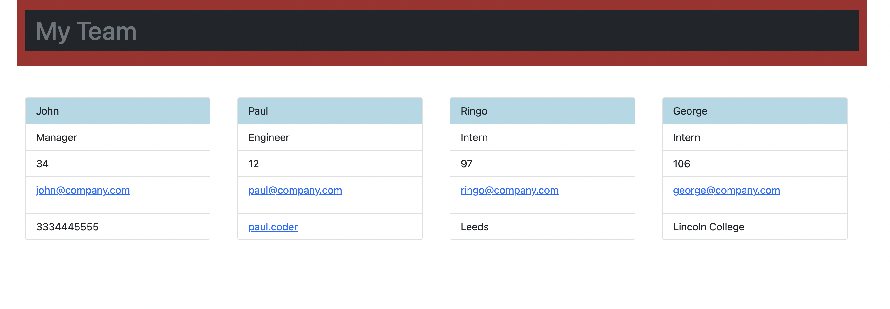
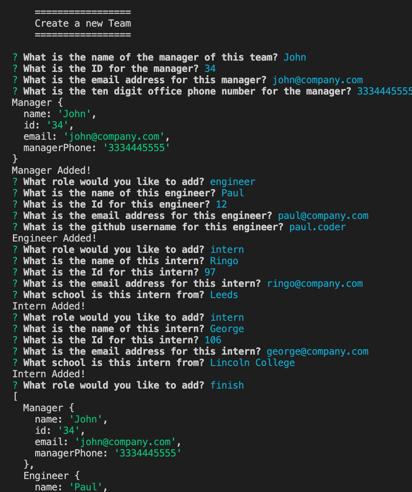

# team-profile-generator

## Description
A CLI program that prompts users to choose employees they want to create, starting with roles, and then asks for additional individual details pertaining to those roles. The program outputs a simple html representation of the team, displaying all information gathered from the inquirer questions, and including active links to emails and github profiles. 

## Languages
JavaScript
HTML
CSS
node.js
jest
inquirer

## Screenshots

## Credits
Created by Thomas Upchurch

## Email 
thomascupchurch@gmail.com

## Github
github.com/thomascupchurch